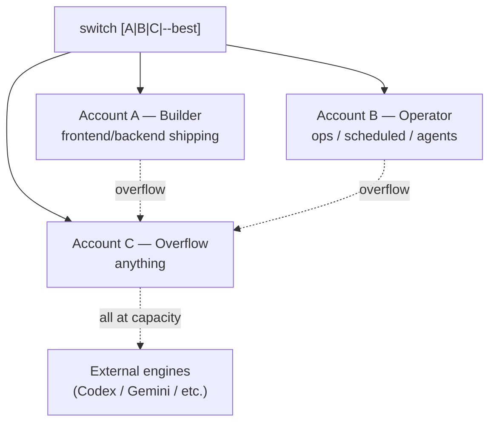

# Pillar 1 — The Token Window

**The scarce resource is Opus-Max tokens, metered in two rolling windows.** Treat capacity as the real budget; everything else (routing, rotation) exists to protect it.

## The two windows

| Window | Span | Behavior |
|---|---|---|
| **5-hour** | rolling 5h | the session limit — exhausts fast under heavy build |
| **7-day** | rolling 7d | the weekly limit — exhausts every ~3 days of hard use |

A single account can't cover a full week of intensive use. That's why the system runs **multiple accounts in rotation**.

## A/B/C account rotation



**Rules:**
- Switch at **70%** weekly usage on the active account.
- **Never drain all accounts** — keep one with ≥20% buffer.
- Lane affinity: A=builder repos, B=ops repos, C=anything. Prevents two accounts burning the same repo.
- Switch takes effect on the **next** session start; running sessions keep their token.

## What tracks it

| Table | Role |
|---|---|
| `account_capacity` | one row per account — current 5h% + 7d% + reset timestamps + which is active |
| `account_capacity_history` | append-only time-series of snapshots (cron every 5 min + on switch) |
| `ai_capacity_ledger` | every AI usage event across all engines — for cost + capacity planning |

A capacity-snapshot cron writes `account_capacity` on a schedule (`cron/capacity-snapshot.sh`, installed via `cron/install-cron.sh`). The token-watch TUI reads it.

## Capacity check (every session start)

Before claiming work: glance at `account_capacity`. If active account 7d% > 70 → switch. If all three are thin → route to external engines (see Pillar 3).

## Switching accounts

`lanes/accounts.sh` implements resolution + capacity-gated switching, exposed via the `bin/claude-switch` CLI:

```bash
claude-switch              # show active account + A/B/C capacity
claude-switch B            # switch to B (refused if 5h≥95% or 7d≥90%; --force overrides)
claude-switch --best       # switch to the lowest-usage alternate
claude-switch --dry-run B  # show the target + capacity, change nothing
```

A switch writes a departure snapshot to `account_capacity_history`, flips `is_active`, and restores the target's token from its vault into the macOS Keychain (vaults are bring-your-own; see README). macOS-only — elsewhere only `accounts.json` is updated.
