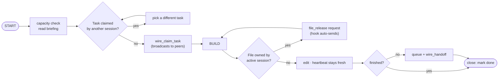
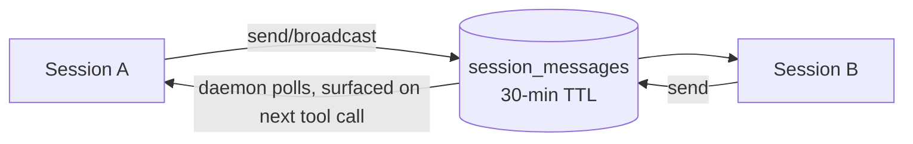

# Pillar 2 — The Battle Station

**Multiple Claude Code sessions run in parallel and coordinate through Supabase** so they never edit the same file or duplicate the same task. Silence is fine in your own lane; wire when paths cross.

## Session lifecycle

## The pieces in this pack

| File | Hook point | Does |
|---|---|---|
| `hooks/auto-register.sh` | PreToolUse `*` | registers this session in `session_locks` on first tool use; bumps heartbeat |
| `hooks/wire-inbox.sh` | PreToolUse `*` | surfaces unread Wire messages (throttled ~30s) as a prompt |
| `hooks/file-lock-check.sh` | PreToolUse Edit/Write | **blocks** editing a file another active session owns; auto-sends a `file_release` request |
| `hooks/build-ledger.sh` | PostToolUse Bash | logs every git commit to `build_ledger` (commits, decisions, ideas) |
| `lib/wire.sh` | sourced | `wire_send` / `wire_broadcast` / `wire_claim_task` / `wire_handoff` / `wire_ack` |
| `lib/wire-daemon.py` | background | real-time inbox poller (adaptive 3s→300s by activity) |

## Wire — inter-session messaging

| Type | When | Payload |
|---|---|---|
| `question` / `ack` | ask / answer another session | `{question}` / `{message, ack_message_id}` |
| `info` / `status` | FYI / broadcast progress | `{message}` |
| `file_release` | request a file lock | `{file_path, reason}` |
| `patch` | ask a session to apply code | `{file_path, diff}` |
| `task_claim` / `task_handoff` | claim / pass work | `{task_id, task_name}` / `{task_id, context}` |

Respond within the same session — don't defer.

## Work division rules
1. One task per session. Finish or hand off before the next.
2. Check who owns a task before writing code.
3. Repo affinity (A=builder, B=ops, C=anything).
4. Don't edit files another active session owns — the hook enforces it.
5. Prefix commits with `[DECISION]` when you pick an approach over alternatives.
6. Queue, don't drop, unfinished work before closing.

## Tables
`session_locks` (who's active, file owners) · `session_messages` (Wire, 30-min TTL) · `session_tasks` (per-task log) · `working_sessions` (groups 5h sessions into a sitting) · `build_ledger` (everything shipped).
