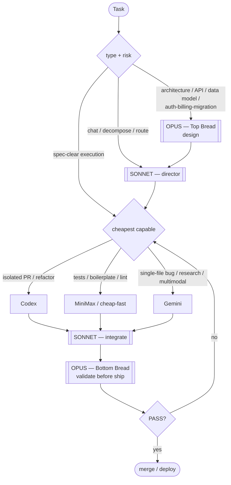

# Pillar 3 — The Token Matrix (Opus Sandwich)

**Opus is the bread; cheap engines are the meat.** Spend the expensive model on judgment (design + validation), not on typing. Sonnet directs.



## Layer stack
1. **Opus (top)** — architecture, API shape, data model, high-blast-radius (auth/billing/migrations). Gated.
2. **Sonnet** — think, decompose, route, dispatch, integrate. The default session.
3. **Cheap engines** — execute spec-clear work in parallel.
4. **Sonnet** — collect + integrate results.
5. **Opus (bottom)** — validate before any merge/deploy. Never delegated to cheap engines.

## Routing table

| Work | Route to |
|---|---|
| Isolated PR · multi-file refactor | Codex |
| Tests · boilerplate · types · lint · renames | cheap-fast model |
| Single-file bug w/ clear spec · polish | Gemini |
| Research / docs (no code) · real-time / multimodal | Gemini |
| Architecture · API · data model · auth/billing/migration | **Opus** |
| Pre-merge audit / security review | **Opus** (never delegated) |

## Rules
1. **Default to cheap.** Spec-clear → cheapest capable engine.
2. **Sandwich anything risky.** Opus designs → cheap executes → Opus validates.
3. **Audit always on Opus.** The bottom bread is non-negotiable.
4. **Parallel where possible.** Fire independent sub-tasks across engines; Sonnet integrates.
5. **Escalate freely.** Sonnet bumps to Opus whenever judgment demands — be cheap on typing, not on thinking.

> Swap engine names for whatever you actually have API access to. The *shape* (Opus bread / Sonnet director / cheap meat) is the invariant, not the specific vendors.

## Implementation

The routing table above is encoded as a deterministic classifier:

- **`lib/route.py`** — `classify_task(description, task_type=None, risk=None)` returns
  `{engine, dispatch, in_session, confidence, reason}`. Stdlib only, no API calls.
  `opus`/`sonnet` are `in_session` (handled by the main Claude session);
  `codex`/`gemini`/`minimax`/`kimi` are external (the `dispatch` field is the
  `bs-dispatch.sh --engine` value, e.g. `minimax → mm`). Audit/security always
  overrides to Opus; explicit `risk=high` escalates cheap routes to Opus unless
  the task is clearly tests/boilerplate.
- **`bin/bs-route`** — CLI wrapper. Classify only, or `--dispatch --task <name>
  --prompt-file <path>` to hand external engines to `bs-dispatch.sh` (found via
  `$BS_DISPATCH`; it lives in the live battlestation, not this pack). In-session
  engines are never dispatched.
- **`tests/test_route.py`** — `python3 -m unittest tests.test_route`.

```bash
bs-route "add unit tests for the parser"          # → minimax (dispatch:mm)
bs-route --type refactor "split the god object"   # → codex
bs-route --risk high "tweak the billing webhook"  # → opus (in-session)
```
