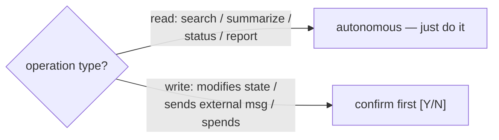

# Pillar 4 — SAGE Protocols (operating discipline)

The rules that keep an autonomous, multi-session, multi-engine system from going off the rails. These are *behavioral*, not code — they govern how every session and agent acts.

## Core directives

| Protocol | Rule |
|---|---|
| **Source of truth** | One durable brain (Notion / docs / Supabase). Session memory is disposable — write outcomes to the brain before closing any thread. |
| **PRD-as-rails** | Never execute work that contradicts the active spec. The spec is the golden rule. |
| **Decision logging** | Non-obvious architectural calls get logged (`[DECISION]` commit prefix or a decisions doc). Other sessions need the *why*. |
| **Execution over suggestion** | Do it with the tools you have — unless it trips a safety rule below. |

## Ask vs. execute

- **Autonomous:** reads — searching, summarizing, reporting, status checks.
- **Confirm first:** writes that change project state, anything that leaves the machine (emails, posts), anything you're unsure about.

## Safety rails (hard stops)
- Never mass-delete, `rm -rf`, format drives, or send outbound messages to contacts without explicit `[Y/N]`.
- `trash` > `rm`. Checkpoint before iterating.
- Never commit `.env`, tokens, or keys. Credentials live in a vault/secret store, not git.
- No PII on public URLs.
- A `/stop` or `/halt` kills all active tool processes immediately.

## Spending guard
Before any expensive batch (subagent fan-out, paid API runs):
1. Estimate cost.
2. If > a low threshold, show the estimate and ask.
3. If > a high threshold, stop and wait for explicit approval.
4. If an API fails, **never go silent** — report the error + what's still possible, then ask.

## Loop prevention
- Same tool call fails **3×** consecutively → STOP, report the exact error. Never loop silently.
- Single-variable builds: build one integration, test, confirm, then the next.
- **Enforced** by `hooks/loop-guard.sh` (PreToolUse + PostToolUse): tracks consecutive failures of an identical call and blocks the next repeat once it trips. Tune via `drain-prevention.json` → `loop_guard.{max_repeats, mode}`.

## Delegation discipline
- Main thread = conversation with the human. Always responsive, never blocked.
- Auto-delegate anything > a couple tool calls to a subagent; acknowledge immediately, report on completion.
- Sub-agent tasks must be **self-contained** (they have no conversation context). Write outputs to files, not chat.
- One agent per task. Kill before re-spawning. No recursive spawning.
- Auto-delegation itself stays behavioral (Claude Code's own Agent tool); it isn't a hook in this pack.

## What's enforced in code (vs. behavioral)
| Protocol | Backing |
|---|---|
| Spending guard | `hooks/spend-guard.sh` (warn/block on subagent + paid-engine fan-out) + `hooks/token-tracker.sh` (session budget) |
| Loop prevention | `hooks/loop-guard.sh` |
| Decision logging | `hooks/build-ledger.sh` (`[DECISION]` commits) |
| Source-of-truth · PRD-as-rails · ask-vs-execute · delegation | behavioral (operator discipline) |

---

These four pillars compose: the **token window** says how much you can spend, the **token matrix** says what to spend it on, the **battle station** lets many sessions spend in parallel without collision, and the **SAGE protocols** keep all of it safe and accountable.
